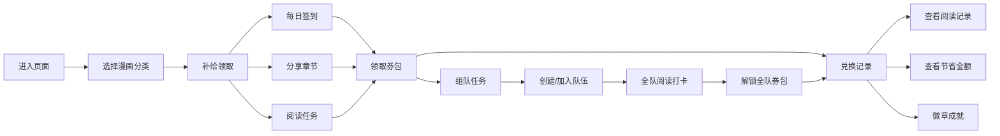

## 1. 产品概述

"追番补给站"是一款面向校园漫画社和学生读者的趣味化纯前端券包运营小游戏，将正版阅读券包装成"追番补给"的形式，通过游戏化运营推广校园正版阅读。

- 核心目标：通过趣味化的任务系统和社交组队，鼓励学生阅读正版漫画，培养正版阅读习惯
- 目标用户：高校学生、漫画社成员、热爱漫画的年轻读者
- 产品价值：将枯燥的运营活动转化为轻松有趣的游戏体验，提升正版阅读转化率

## 2. 核心功能

### 2.1 用户角色

| 角色 | 注册方式 | 核心权限 |
|------|----------|----------|
| 学生用户 | 模拟登录（纯前端） | 领取补给、组队任务、查看兑换记录 |

### 2.2 功能模块

1. **补给领取页**：漫画分类选择、每日签到、分享任务、连续阅读任务、券包领取
2. **组队任务页**：创建/加入队伍、队伍进度展示、全队券包解锁
3. **兑换记录页**：用券阅读记录、节省金额统计、到期提醒、徽章成就

### 2.3 页面详情

| 页面名称 | 模块名称 | 功能描述 |
|----------|----------|----------|
| 补给领取页 | 分类选择 | 学生选择关注的正版漫画分类（热血、恋爱、悬疑等） |
| 补给领取页 | 每日签到 | 每日签到领取小额券包，连续签到有额外奖励 |
| 补给领取页 | 分享任务 | 分享正版章节页完成任务，领取补给券 |
| 补给领取页 | 阅读任务 | 连续阅读指定章节后领取券包奖励 |
| 补给领取页 | 券包展示 | 展示已获得的券包，包含面额、有效期、使用范围提示 |
| 组队任务页 | 创建/加入队伍 | 支持3-5人组队，可通过队伍码加入 |
| 组队任务页 | 队伍进度 | 展示全队共同阅读天数进度条 |
| 组队任务页 | 奖励解锁 | 达到目标天数后解锁全队可用券包 |
| 组队任务页 | 正版提示 | 明确提示券只能用于平台内正版章节 |
| 兑换记录页 | 阅读记录 | 展示用券阅读的作品列表 |
| 兑换记录页 | 节省金额 | 统计累计节省金额，用进度条可视化 |
| 兑换记录页 | 到期提醒 | 即将到期的券包高亮提醒 |
| 兑换记录页 | 徽章系统 | 展示成就徽章，替代复杂运营报表 |

## 3. 核心流程

用户进入页面 → 选择关注的漫画分类 → 完成每日任务（签到/分享/阅读）→ 领取券包补给 → 可选择组队完成共同任务 → 使用券包阅读正版漫画 → 查看兑换记录和成就徽章

## 4. 用户界面设计

### 4.1 设计风格

- **主色调**：活力橙 (#FF6B35) 作为主色，代表热情和活力
- **辅助色**：漫画粉 (#FF85A2)、二次元蓝 (#4ECDC4)、神秘紫 (#9B5DE5)
- **中性色**：深灰 (#2D3436)、浅灰 (#F8F9FA)
- **按钮风格**：圆角胶囊型按钮，带有渐变和微动画，hover时有缩放效果
- **字体**：ZCOOL KuaiLe（展示字体，活泼有趣）+ Noto Sans SC（正文字体，清晰易读）
- **布局风格**：卡片式布局，圆角设计，带有柔和阴影和渐变背景
- **图标风格**：emoji + lucide图标结合，可爱活泼

### 4.2 页面设计概览

| 页面名称 | 模块名称 | UI元素 |
|----------|----------|--------|
| 补给领取页 | 分类选择 | 彩色分类卡片，emoji图标，选中态有发光效果 |
| 补给领取页 | 签到模块 | 日历式签到，连续签到高亮，领取动效 |
| 补给领取页 | 任务卡片 | 进度条，任务状态，领取按钮 |
| 补给领取页 | 券包展示 | 立体券包样式，撕开效果动画 |
| 组队任务页 | 队伍卡片 | 队员头像展示，进度条，倒计时 |
| 组队任务页 | 队伍操作 | 创建/加入弹窗，队伍码复制 |
| 组队任务页 | 正版提示 | 醒目的提示条，强调正版阅读 |
| 兑换记录页 | 记录列表 | 作品封面，阅读进度，节省金额标签 |
| 兑换记录页 | 统计面板 | 大型进度条，数字滚动动画 |
| 兑换记录页 | 徽章墙 | 网格布局，解锁动效，徽章详情弹窗 |

### 4.3 响应式设计

- 桌面端优先设计，最大宽度1200px
- 移动端自适应布局，卡片自动换行
- 触摸优化：按钮最小高度48px，充足间距
- 断点：768px（平板）、480px（手机）

### 4.4 动效设计

- 页面加载：元素渐入+上移动画，错落延迟
- 券包领取：弹跳+旋转动效，粒子爆炸效果
- 进度更新：平滑过渡动画
- 徽章解锁：缩放+发光动效
- 按钮交互：hover时轻微上浮+阴影加深，click时缩放反馈
