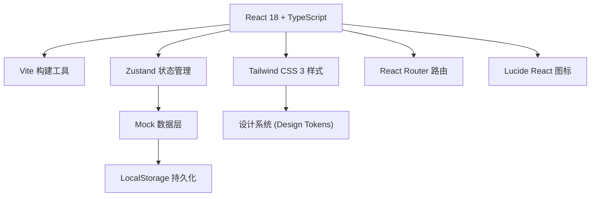
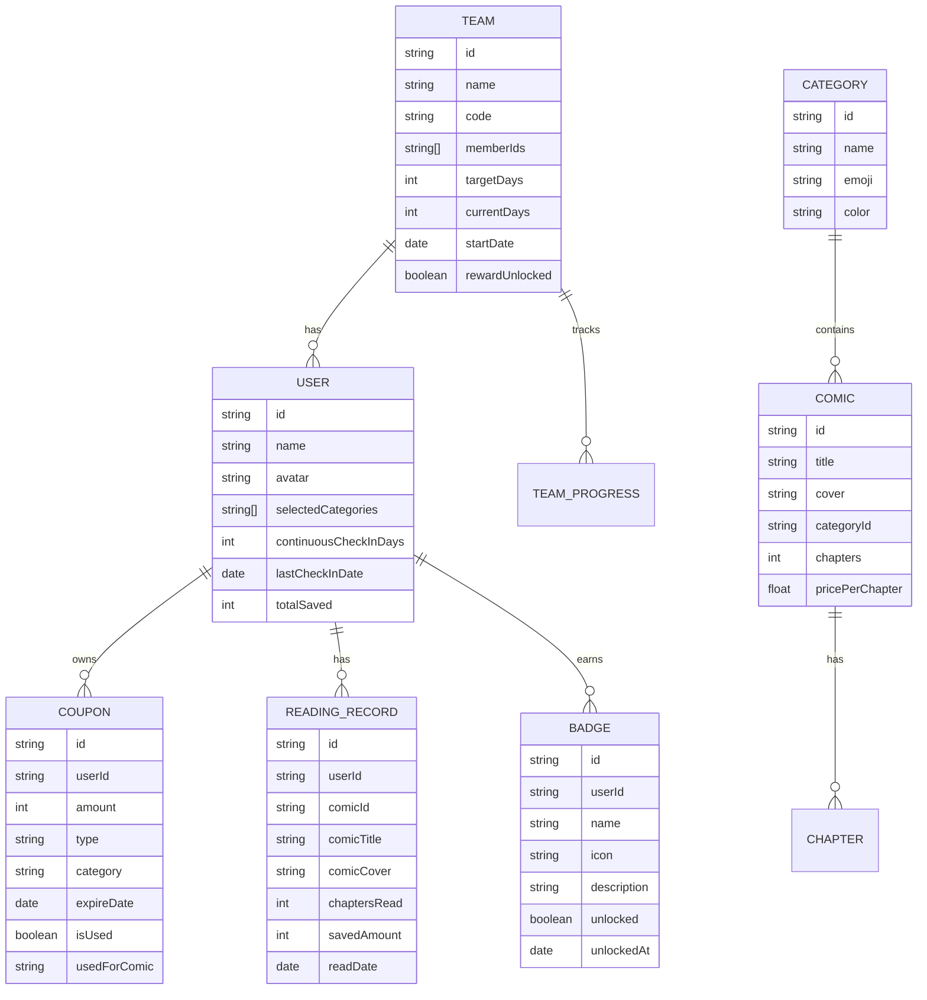

## 1. 架构设计



## 2. 技术说明

- **前端框架**：React 18 + TypeScript
- **构建工具**：Vite 5
- **样式方案**：Tailwind CSS 3
- **状态管理**：Zustand
- **路由管理**：React Router DOM 6
- **图标库**：Lucide React
- **数据持久化**：LocalStorage（模拟后端）
- **数据来源**：纯前端Mock数据，无后端依赖

## 3. 路由定义

| 路由 | 页面 | 用途 |
|------|------|------|
| / | 补给领取页 | 首页，展示分类选择和每日任务 |
| /team | 组队任务页 | 组队功能和队伍进度 |
| /records | 兑换记录页 | 阅读记录和成就徽章 |

## 4. 数据模型

### 4.1 数据模型定义



### 4.2 核心数据结构

```typescript
// 用户信息
interface User {
  id: string;
  name: string;
  avatar: string;
  selectedCategories: string[];
  continuousCheckInDays: number;
  lastCheckInDate: string;
  totalSaved: number;
}

// 券包
interface Coupon {
  id: string;
  userId: string;
  amount: number;
  type: 'daily' | 'share' | 'reading' | 'team';
  category: string;
  expireDate: string;
  isUsed: boolean;
  usedForComic?: string;
}

// 队伍
interface Team {
  id: string;
  name: string;
  code: string;
  memberIds: string[];
  targetDays: number;
  currentDays: number;
  startDate: string;
  rewardUnlocked: boolean;
}

// 阅读记录
interface ReadingRecord {
  id: string;
  userId: string;
  comicId: string;
  comicTitle: string;
  comicCover: string;
  chaptersRead: number;
  savedAmount: number;
  readDate: string;
}

// 徽章
interface Badge {
  id: string;
  userId: string;
  name: string;
  icon: string;
  description: string;
  unlocked: boolean;
  unlockedAt?: string;
}

// 漫画分类
interface Category {
  id: string;
  name: string;
  emoji: string;
  color: string;
}

// 漫画
interface Comic {
  id: string;
  title: string;
  cover: string;
  categoryId: string;
  chapters: number;
  pricePerChapter: number;
}
```

## 5. 目录结构

```
src/
├── components/          # 公共组件
│   ├── Layout/         # 布局组件
│   ├── CouponCard/     # 券包卡片
│   ├── TaskCard/       # 任务卡片
│   ├── ProgressBar/    # 进度条组件
│   ├── BadgeItem/      # 徽章组件
│   └── CategoryCard/   # 分类卡片
├── pages/              # 页面组件
│   ├── Supply.tsx      # 补给领取页
│   ├── Team.tsx        # 组队任务页
│   └── Records.tsx     # 兑换记录页
├── store/              # 状态管理
│   └── useStore.ts     # Zustand store
├── data/               # Mock数据
│   ├── categories.ts   # 分类数据
│   ├── comics.ts       # 漫画数据
│   └── badges.ts       # 徽章数据
├── utils/              # 工具函数
│   ├── date.ts         # 日期处理
│   └── coupon.ts       # 券包工具
├── types/              # 类型定义
│   └── index.ts        # 全局类型
├── App.tsx             # 根组件
├── main.tsx            # 入口文件
└── index.css           # 全局样式
```
